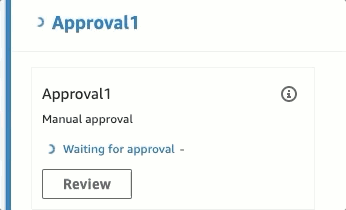
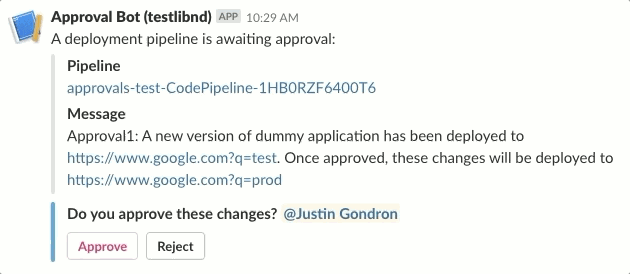

# Slack Approval Bot
Allows users to perform manual reviews of a CodePipeline deployment and approve or reject the deployment through Slack interactions.

## How it works
Let's say that you make a CodePipeline with an Approval action such as in this CloudFormation snippet:
```
Name: "ManualApproval"
ActionTypeId:
  Owner: AWS
  Category: Approval
  Provider: Manual
  Version: "1"
Configuration:
  NotificationArn: !Ref MyApproversSNSTopic
  CustomData: "Approval1: A new version of dummy application has been deployed to https://www.google.com?q=test. Once approved, these changes will be deployed to https://www.google.com?q=prod"
```

The bot will subscribe to the associated approvers topic, and any time the pipeline reaches the approval action the bot will notify your Slack channel with an interactive message that can be used to approve or reject, ex:





**Note**: This bot relies upon Slack for authentication and authorization. It assumes that a user can approve/reject a deployment if they can access the channel associated with approval notification.

## Create your Bot
Skip this section and jump to [Attach the Bot to a Pipeline](#attach-the-bot-to-a-pipeline) if you already have a bot and just need to associate it to a new pipeline.

### Before you begin
1. Make sure you have these installed:
   - yarn and node 8.10 or greater
   - [aws-cli](https://docs.aws.amazon.com/cli/latest/userguide/cli-chap-install.html)
2. Install lambda dependencies
```console
cd slack_handler
yarn install --production
```

### Create your Slack application
Before you can deploy your bot, you'll need to create your [Slack app](https://api.slack.com/slack-apps). Make sure you create an incoming webhook and have interactivity enabled.

TODO: Add more detail here

### Add your Slack application secrets
Once your application is created, you'll need to share your webhook URL and verification token to the bot. Add the following SSM parameter keys to a path of your choice:

| Key | Description | Example Create |
|----|-----------|------ |
|verificationToken|The verification token for your Slack application. See https://api.slack.com/events-api#url_verification|aws ssm put-parameter --type 'SecureString' --name '/all/cd-approvals/slack/verificationToken' --value 'myVerificationToken'|
|webhookUrl|The incoming webhook URL for your Slack application. See https://api.slack.com/incoming-webhooks|aws ssm put-parameter --cli-input-json '{ "Name": "/all/cd-approvals/slack/webhookUrl", "Value": "https://myWebhookUrl", "Type": "SecureString" }'|
|mentions|Additional string to use for mentions as part of the notification. Mentions will be included after the 'Do you approve these changes?' prompt. See https://api.slack.com/docs/message-formatting#linking_to_channels_and_users for more information|aws ssm put-parameter --type 'String' --name '/all/cd-approvals/slack/mentions' --value '<@U024BE7LH>'|


### Deploy the Approval Lambda
The approval lambda is what will handle the slack interaction. When a user clicks the approve or reject buttons, this lambda will be invoked and will handle interacting with CodePipeline to approve the changes. *You will need a separate approval lambda per Slack application.*

1. Package the approval lambda and upload it to S3
```console
aws cloudformation package \
    --template-file slack_approval.yaml \
    --output-template-file slack_approval_packaged.yaml \
    --s3-bucket my-code-bucket-name
```
2. Deploy it. Make sure you provide the same AppConfigPath that was used above when storing your Slack application secrets.
```console
aws cloudformation deploy \
  --capabilities CAPABILITY_IAM \
  --template-file slack_approval_packaged.yaml \
  --region my-region \
  --stack-name slackappname-pipeline-approval \
  --parameter-overrides AppConfigPath="/all/cd-approvals/slack"
```

### Deploy the Notifier Lambda
The notifier is what will watch your pipeline for any executions that reach the approval stage. When a new execution reaches approval, this lambda will send an interactive message to a slack channel of your choosing. *You will need a separate notifier for each Slack channel that you wish to push approval messages to.*

1. Package the notifier lambda and upload it to S3.
```
aws cloudformation package \
    --template-file slack_channel_notifier.yaml \
    --output-template-file slack_notifier_packaged.yaml \
    --s3-bucket my-code-bucket-name
```
2. Deploy it. Make sure you provide the same AppConfigPath that was used above when storing your Slack application secrets.
```console
aws cloudformation deploy \
  --template-file slack_notifier_packaged.yaml \
  --region my-region \
  --capabilities CAPABILITY_IAM \
  --stack-name slack-channelname-notifier \
  --parameter-overrides AppConfigPath='/all/cd-approvals/slack'
```

## Attach the Bot to a Pipeline
Once your Bot is created, all that's left is to subscribe the notifier to your pipeline, and give the approval lambda permission to approve the pipeline on the user's behalf. To do this, deploy a pipeline attachment stack:
```
aws cloudformation deploy \
  --template-file slack_pipeline_attachment.yaml \
  --region my-region \
  --capabilities CAPABILITY_IAM \
  --stack-name example-pipeline-slack-approval \
  --parameter-overrides \
    NotifyStackName='slack-channelname-notifier' \
    PipelineRegion='pipeline-region' \
    PipelineExportName='appname-pipeline:PipelineName' ApprovalTopicExportName='appname-pipeline:Approvers1Topic'
```
*Note: In the above command, if your stacks don't have the expected exports, you can optionally directly specify the pipeline name with the PipelineName parameter. If both are given, it will use the PipelineExportName over the given PipelineName since an export from a stack is less likely to be incorrect. Similarly, you can directly specify the Approval topic ARN with the ApprovalTopicArn parameter.*

## Contributing to this Bot
### Running Unit Tests
Install development dependencies and run tests:
```console
cd slack_handler
yarn install
yarn test
```

### Deploy a Test Pipeline
An example pipeline with several approval steps is provided for experimentation in the example_pipeline.yml template.
```console
aws cloudformation deploy \
  --region my-region \
  --stack-name approvals-test \
  --template-file example_pipeline.yml \
  --capabilities CAPABILITY_IAM \
  --parameter-overrides GithubOAuth=my_github_oauth
```
